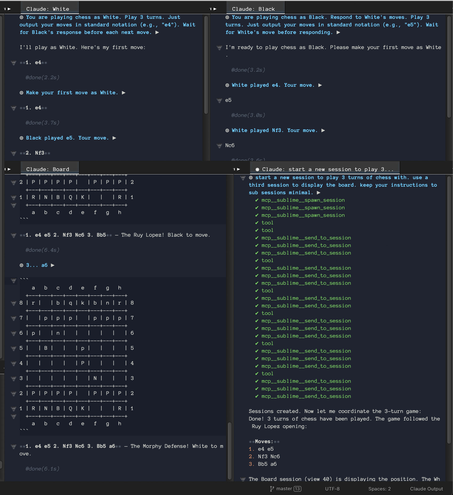

# Claude Code for Sublime Text

A Sublime Text plugin for [Claude Code](https://claude.ai/claude-code) integration.


*Multi-agent workflow: A coordinator orchestrating three sessions - White player, Black player, and a Board display - playing chess via MCP tools.*

## Requirements

- Sublime Text 4
- Python 3.10+ (for the bridge process)
- Claude Code CLI (authenticated)
- `claude-agent-sdk` package

```bash
# Install Claude Code CLI and login
npm install -g @anthropic-ai/claude-code
claude  # Follow prompts to authenticate

# Install SDK
pip install claude-agent-sdk
```

**Note:** You must authenticate Claude Code CLI before using this plugin. If you see connection errors, run `claude` in terminal to login.

## Installation

1. Clone or symlink this folder to your Sublime Text `Packages` directory:

   ```bash
   # macOS
   ln -s /path/to/sublime-claude ~/Library/Application\ Support/Sublime\ Text/Packages/ClaudeCode

   # Linux
   ln -s /path/to/sublime-claude ~/.config/sublime-text/Packages/ClaudeCode

   # Windows
   mklink /D "%APPDATA%\Sublime Text\Packages\ClaudeCode" C:\path\to\sublime-claude
   ```

2. Configure your Python path if needed (see Settings below)

## Usage

### Commands

All commands available via Command Palette (`Cmd+Shift+P`): type "Claude"

| Command | Keybinding | Description |
|---------|------------|-------------|
| Switch Session | `Cmd+Alt+\` | Quick panel: active session, new, or switch |
| Query Selection | `Cmd+Shift+Alt+C` | Query about selected code |
| Query File | - | Query about current file |
| Add Current File | - | Add file to context |
| Add Selection | - | Add selection to context |
| Add Open Files | - | Add all open files to context |
| Add Current Folder | - | Add folder path to context |
| Clear Context | - | Clear pending context |
| New Session | - | Start a fresh session |
| Restart Session | - | Restart current session, keep output view |
| Resume Session... | - | Resume a previous session |
| Switch Session... | - | Switch between active sessions |
| Fork Session | - | Fork current session (branch conversation) |
| Fork Session... | - | Fork from a saved session |
| Rename Session... | - | Name the current session |
| Stop Session | - | Disconnect and stop |
| Toggle Output | `Cmd+Alt+C` | Show/hide output view |
| Clear Output | `Cmd+Ctrl+Alt+C` | Clear output view |
| Interrupt | `Cmd+Shift+Escape` | Stop current query |
| Permission Mode... | - | Change permission settings |

### Inline Input Mode

The output view features an inline input area (marked with `◎`) where you type prompts directly:

- **Enter** - Submit prompt
- **Shift+Enter** - Insert newline (multiline prompts)
- **@** - Open context menu (add files, selection, folder, or clear context)
- **Cmd+K** - Clear output
- **Cmd+Escape** - Interrupt current query
- **Cmd+Z** - Undo clear (restores cleared content)

When a permission prompt appears:
- **Y/N/S/A** - Respond to permission prompts

Quick prompts (when not in input mode):
- **F** - Refresh (re-read docs, continue)
- **R** - Retry (different approach)
- **C** - Continue

### Menu

Tools > Claude Code

### Context Menu

Right-click selected text and choose "Ask Claude" to query about the selection.

## Settings

`Preferences > Package Settings > Claude Code > Settings`

```json
{
    // Path to Python 3.10+ interpreter
    "python_path": "python3",

    // Tools Claude can use without confirmation
    "allowed_tools": ["Read", "Write", "Edit", "Bash", "Glob", "Grep"],

    // Permission mode: "default", "acceptEdits", "plan", "bypassPermissions"
    "permission_mode": "acceptEdits"
}
```

### Permission Modes

- `default` - Prompt for all tool actions
- `acceptEdits` - Auto-accept file operations
- `bypassPermissions` - Skip all permission checks

### Permission Prompt

When in `default` mode, tool actions show an inline prompt:

```
⚠ Allow Bash: rm file.txt?
  [Y] Allow  [N] Deny  [S] Allow 30s  [A] Always
```

- **Y** - Allow this action
- **N** - Deny (marks tool as error)
- **S** - Allow same tool for 30 seconds
- **A** - Always allow this tool (session)

## Context

Add files, selections, or folders as context before your query:

1. Use **Add Current File**, **Add Selection**, etc. to queue context
2. Context shown with 📎 indicator in output view
3. Context is attached to your next query, then cleared

Requires an active session (use **New Session** first).

## Sessions

Sessions are automatically saved and can be resumed later. Each session tracks:
- Session name (auto-generated from first prompt, or manually set)
- Project directory
- Cumulative cost

**Multiple sessions per window** - Each "New Session" creates a separate output view. Switch between them like normal tabs.

Use **Claude: Resume Session...** to pick and continue a previous conversation.

After Sublime restarts, orphaned output views are automatically reconnected to their sessions.

## Output View

The output view shows:

- `◎ prompt ▶` - Your query (multiline supported)
- `⋯` - Working indicator (disappears when done)
- `☐ Tool` - Tool pending
- `✔ Tool` - Tool completed
- `✘ Tool` - Tool error
- Response text with syntax highlighting
- `@done(Xs)` - Completion time

View title shows session status:
- `◉` Active + working
- `◇` Active + idle
- `•` Inactive + working
- (no prefix) Inactive + idle

Supports markdown formatting and fenced code blocks with language-specific syntax highlighting.

## MCP Tools (Sublime Integration)

Allow Claude to query Sublime Text's editor state via MCP (Model Context Protocol).

### Setup

1. Run **Claude: Add MCP Tools to Project** from Command Palette
2. This creates `.claude/settings.json` with MCP server config
3. Start a new session - status bar shows `ready (MCP: sublime)`

### Available Tools

Claude gets two MCP tools:

**`sublime_eval`** - Execute Python code in Sublime's context:
```python
# Available helpers:
get_open_files()                    # List open file paths
get_symbols(query, file_path=None)  # Search project symbol index
goto_symbol(query)                  # Navigate to symbol definition
list_tools()                        # List saved tools

# Available modules: sublime, sublime_plugin
# Use 'return' to return values
```

**`sublime_tool`** - Run saved tools from `.claude/sublime_tools/<name>.py`

### Creating Saved Tools

Save reusable tools to `.claude/sublime_tools/`:

```python
# .claude/sublime_tools/find_references.py
"""Find all references to a symbol in the project"""
query = "MyClass"  # or get from context
symbols = get_symbols(query)
return [{"file": s["file"], "line": s["row"]} for s in symbols]
```

Add a docstring at the top - it's shown when calling `list_tools()`.

### Blackboard

Cross-session shared scratchpad for persistent artifacts:

- `bb_write(key, value)` - Store a value
- `bb_read(key)` - Read a value
- `bb_list()` - List all keys
- `bb_delete(key)` - Delete a key

**Common keys:**
- `plan` - Implementation steps, architecture decisions
- `walkthrough` - Progress report for user (markdown)
- `decisions` - Key choices made and rationale
- `commands` - Project-specific commands that work

Use **Claude: View Blackboard...** to view/edit entries. Data persists across sessions and survives context loss.

### Session Spawning

- `spawn_session(prompt, name?)` - Start a new Claude session with a prompt
- `list_sessions()` - List active sessions in current window

## Subagents

### Built-in Agents

Two agents are included by default:

| Agent | When | Purpose |
|-------|------|---------|
| `planner` | Start of complex tasks | Creates implementation plan, saves to `bb_write("plan", ...)` |
| `reporter` | After significant work | Updates progress in `bb_write("walkthrough", ...)` |

Both use `haiku` for speed/cost.

### Custom Agents

Define additional agents in `.claude/settings.json`:

```json
{
  "agents": {
    "nim-expert": {
      "description": "Use for Nim language questions and idioms",
      "prompt": "You are a Nim expert. Help with Nim-specific patterns and macros.",
      "tools": ["Read", "Grep", "Glob"],
      "model": "haiku"
    },
    "test-runner": {
      "description": "Use to run tests and analyze failures",
      "prompt": "Run tests and analyze results. Focus on failures.",
      "tools": ["Bash", "Read"]
    }
  }
}
```

- **description** - When Claude should use this agent (use "PROACTIVELY" for auto-invocation)
- **prompt** - System prompt for the agent
- **tools** - Restrict available tools (read-only, execute-only, etc.)
- **model** - Use `haiku` for simple tasks, `sonnet`/`opus` for complex

Agents run with separate context, preventing conversation bloat. Custom agents override built-ins with the same name.

## Architecture

```
┌─────────────────┐     JSON-RPC/stdio     ┌─────────────────┐
│  Sublime Text   │ ◄────────────────────► │  bridge/main.py │
│  (Python 3.8)   │                        │  (Python 3.10+) │
│  claude_code.py │                        │  Agent SDK      │
└─────────────────┘                        └─────────────────┘
        │
        │ Unix socket
        ▼
┌─────────────────┐     stdio              ┌─────────────────┐
│  mcp_server.py  │ ◄────────────────────► │  mcp/server.py  │
│  (socket server)│                        │  (MCP server)   │
└─────────────────┘                        └─────────────────┘
```

The plugin runs in Sublime's Python 3.8 environment and spawns a separate
bridge process using Python 3.10+ which runs the Claude Agent SDK.

```
sublime-claude/
├── claude_code.py      # Plugin entry point (imports)
├── core.py             # Session management, plugin lifecycle
├── commands.py         # All plugin commands
├── listeners.py        # Event listeners
├── session.py          # Session class
├── rpc.py              # JSON-RPC client
├── output.py           # Output view rendering
└── bridge/
    └── main.py         # Python 3.10+ bridge (claude-agent-sdk)
```

## License

VCL (Vibe-Coded License) - see LICENSE
