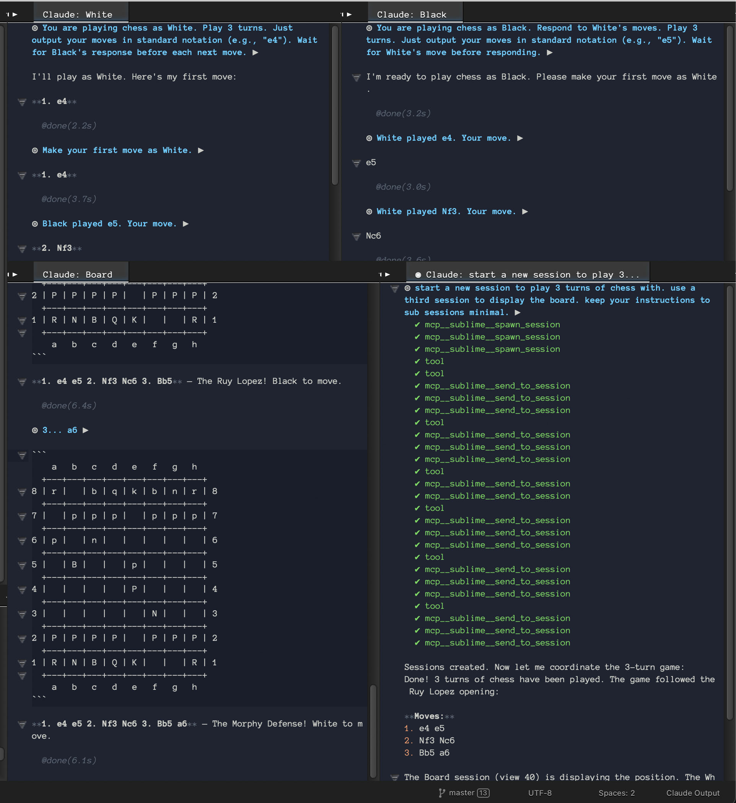

# Claude Code for Sublime Text

A Sublime Text plugin for [Claude Code](https://claude.ai/claude-code) and [Codex CLI](https://github.com/openai/codex) integration.


*Multi-agent workflow: A coordinator orchestrating three sessions - White player, Black player, and a Board display - playing chess via MCP tools.*

## Requirements

- Sublime Text 4
- Python 3.10+ (for the bridge process)
- Claude Code CLI (authenticated) and/or Codex CLI
- `claude-agent-sdk` package (for Claude backend)

```bash
# Claude Code
npm install -g @anthropic-ai/claude-code
claude  # Follow prompts to authenticate
pip install claude-agent-sdk

# Codex CLI (optional)
npm install -g @openai/codex
codex  # Follow prompts to authenticate
```

**Note:** You must authenticate your chosen CLI before using this plugin. If you see connection errors, run `claude` or `codex` in terminal to login.

## Installation

1. Clone or symlink this folder to your Sublime Text `Packages` directory:

   ```bash
   # macOS
   ln -s /path/to/sublime-claude ~/Library/Application\ Support/Sublime\ Text/Packages/ClaudeCode

   # Linux
   ln -s /path/to/sublime-claude ~/.config/sublime-text/Packages/ClaudeCode

   # Windows
   mklink /D "%APPDATA%\Sublime Text\Packages\ClaudeCode" C:\path\to\sublime-claude
   ```

2. Configure your Python path if needed (see Settings below)

## Usage

### Commands

All commands available via Command Palette (`Cmd+Shift+P`): type "Claude"

| Command | Keybinding | Description |
|---------|------------|-------------|
| Switch Session | `Cmd+Alt+\` | Quick panel: active session, new, or switch |
| Query Selection | `Cmd+Shift+Alt+C` | Query about selected code |
| Query File | - | Query about current file |
| Add Current File | - | Add file to context |
| Add Selection | - | Add selection to context |
| Add Open Files | - | Add all open files to context |
| Add Current Folder | - | Add folder path to context |
| Clear Context | - | Clear pending context |
| New Session | - | Start a fresh Claude session |
| Codex: New Session | - | Start a fresh Codex session |
| Restart Session | - | Restart current session, keep output view |
| Resume Session... | - | Resume a previous session |
| Switch Session... | - | Switch between active sessions |
| Fork Session | - | Fork current session (branch conversation) |
| Fork Session... | - | Fork from a saved session |
| Rename Session... | - | Name the current session |
| Stop Session | - | Disconnect and stop |
| Toggle Output | `Cmd+Alt+C` | Show/hide output view |
| Clear Output | `Cmd+Ctrl+Alt+C` | Clear output view |
| Interrupt | `Cmd+Shift+Escape` | Stop current query |
| Permission Mode... | - | Change permission settings |
| Manage Auto-Allowed Tools... | - | Configure tools that skip permission prompts |

### Inline Input Mode

The output view features an inline input area (marked with `◎`) where you type prompts directly:

- **Enter** - Submit prompt
- **Shift+Enter** - Insert newline (multiline prompts)
- **@** - Open context menu (add files, selection, folder, or clear context)
- **Cmd+K** - Clear output
- **Cmd+Escape** - Interrupt current query
- **Cmd+Z** - Undo clear (restores cleared content)

When a permission prompt appears:
- **Y/N/S/A** - Respond to permission prompts

Quick prompts (when not in input mode):
- **F** - Refresh (re-read docs, continue)
- **R** - Retry (different approach)
- **C** - Continue

### Menu

Tools > Claude Code

### Context Menu

Right-click selected text and choose "Ask Claude" to query about the selection.

## Settings

`Preferences > Package Settings > Claude Code > Settings`

```json
{
    // Path to Python 3.10+ interpreter
    "python_path": "python3",

    // Tools Claude can use without confirmation
    "allowed_tools": ["Read", "Write", "Edit", "Bash", "Glob", "Grep"],

    // Permission mode: "default", "acceptEdits", "plan", "bypassPermissions"
    "permission_mode": "acceptEdits"
}
```

### Permission Modes

- `default` - Prompt for all tool actions
- `acceptEdits` - Auto-accept file operations
- `bypassPermissions` - Skip all permission checks

### Permission Prompt

When in `default` mode, tool actions show an inline prompt:

```
⚠ Allow Bash: rm file.txt?
  [Y] Allow  [N] Deny  [S] Allow 30s  [A] Always
```

- **Y** - Allow this action
- **N** - Deny (marks tool as error)
- **S** - Allow same tool for 30 seconds
- **A** - Always allow this tool (saves to project settings)

### Auto-Allowed Tools

Automatically allow specific tools without permission prompts. Configure via:

**Command:** `Claude: Manage Auto-Allowed Tools...` - UI to add/remove patterns

**Settings:** Add to project `.claude/settings.json` or user `~/.claude/settings.json`:
```json
{
  "autoAllowedMcpTools": [
    "mcp__*__*",        // All MCP tools
    "mcp__plugin_*",    // All plugin MCP tools
    "Read",             // Specific tool
    "Bash"
  ]
}
```

Supports wildcards (`*`) for pattern matching. User-level settings apply to all projects, project settings override.

## Context

Add files, selections, or folders as context before your query:

1. Use **Add Current File**, **Add Selection**, etc. to queue context
2. Context shown with 📎 indicator in output view
3. Context is attached to your next query, then cleared

Requires an active session (use **New Session** first).

## Sessions

Sessions are automatically saved and can be resumed later. Each session tracks:
- Session name (auto-generated from first prompt, or manually set)
- Project directory
- Cumulative cost

**Multiple sessions per window** - Each "New Session" creates a separate output view. Switch between them like normal tabs.

Use **Claude: Resume Session...** to pick and continue a previous conversation.

After Sublime restarts, orphaned output views are automatically reconnected to their sessions.

## Order Table

A simple TODO list for human→agent task assignments. Add orders (tasks) that agents can subscribe to and complete.

### Commands

| Command | Keybinding | Description |
|---------|------------|-------------|
| Add Order at Cursor | `Cmd+Shift+O` | Pin an order at current cursor location |
| Add Order | - | Add order without file location |
| Show Order Table | `Cmd+Alt+O` | Open the order table view |

### Order Table View

The order table shows pending and completed orders:

| Key | Action |
|-----|--------|
| `Enter` / `g` | Go to order location |
| `Cmd+Backspace` | Delete order |
| `u` / `Cmd+Z` | Undo deletion |
| `a` | Add new order |

Orders pinned at cursor positions show a bookmark icon in the gutter.

### Agent Subscription

Agents can subscribe to order notifications via MCP:

```
order("subscribe Check for new orders")  # Subscribe with wake prompt
order("list")                            # List all orders
order("pending")                         # List pending orders only
order("complete order_1")                # Mark order as done
```

When a new order is added, subscribed agents receive a notification with order details.

## Output View

The output view shows:

- `◎ prompt ▶` - Your query (multiline supported)
- `⋯` - Working indicator (disappears when done)
- `☐ Tool` - Tool pending
- `✔ Tool` - Tool completed
- `✘ Tool` - Tool error
- Response text with syntax highlighting
- `@done(Xs)` - Completion time

View title shows session status:
- `◉` Active + working
- `◇` Active + idle
- `•` Inactive + working
- `◇` Inactive + idle
- `❓` Waiting for permission/question response

Codex sessions show a `[codex]` prefix in the tab title.

Supports markdown formatting and fenced code blocks with language-specific syntax highlighting.

## MCP Tools (Sublime Integration)

Allow Claude to query Sublime Text's editor state via MCP (Model Context Protocol).

### Setup

1. Run **Claude: Add MCP Tools to Project** from Command Palette
2. This creates `.claude/settings.json` with MCP server config
3. Start a new session - status bar shows `ready (MCP: sublime)`

### Available Tools

Claude gets two MCP tools:

**`sublime_eval`** - Execute Python code in Sublime's context:
```python
# Available helpers:
get_open_files()                    # List open file paths
get_symbols(query, file_path=None)  # Search project symbol index
goto_symbol(query)                  # Navigate to symbol definition
list_tools()                        # List saved tools

# Available modules: sublime, sublime_plugin
# Use 'return' to return values
```

**`sublime_tool`** - Run saved tools from `.claude/sublime_tools/<name>.py`

### Creating Saved Tools

Save reusable tools to `.claude/sublime_tools/`:

```python
# .claude/sublime_tools/find_references.py
"""Find all references to a symbol in the project"""
query = "MyClass"  # or get from context
symbols = get_symbols(query)
return [{"file": s["file"], "line": s["row"]} for s in symbols]
```

Add a docstring at the top - it's shown when calling `list_tools()`.

### Session Spawning

- `spawn_session(prompt, name?)` - Start a new Claude session with a prompt
- `list_sessions()` - List active sessions in current window

### Alarm System (Event-Driven Waiting)

Instead of polling for subsession completion, sessions can set alarms to "sleep" and wake when events occur. This enables efficient async coordination.

**Usage Pattern:**
```python
# Spawn a subsession
result = spawn_session("Run all tests", name="test-runner")
subsession_id = str(result["view_id"])

# Set alarm to wake when subsession completes (via MCP tool)
set_alarm(
    event_type="subsession_complete",
    event_params={"subsession_id": subsession_id},
    wake_prompt="Tests completed. Summarize results from test-runner."
)
# Main session ends query (goes idle), alarm monitors in background
# When subsession completes, alarm fires and injects wake_prompt
```

**Event Types:**
- `subsession_complete` - Wake when subsession finishes: `{subsession_id: str}`
- `time_elapsed` - Wake after N seconds: `{seconds: int}`
- `agent_complete` - Same as subsession_complete: `{agent_id: str}`

**MCP Tools:**
- `set_alarm(event_type, event_params, wake_prompt, alarm_id=None)`
- `cancel_alarm(alarm_id)`

Subsessions automatically notify the bridge when they complete. The alarm fires by injecting the wake_prompt into the main session as a new query.

## Subagents

### Custom Agents

Define additional agents in `.claude/settings.json`:

```json
{
  "agents": {
    "nim-expert": {
      "description": "Use for Nim language questions and idioms",
      "prompt": "You are a Nim expert. Help with Nim-specific patterns and macros.",
      "tools": ["Read", "Grep", "Glob"],
      "model": "haiku"
    },
    "test-runner": {
      "description": "Use to run tests and analyze failures",
      "prompt": "Run tests and analyze results. Focus on failures.",
      "tools": ["Bash", "Read"]
    }
  }
}
```

- **description** - When Claude should use this agent (use "PROACTIVELY" for auto-invocation)
- **prompt** - System prompt for the agent
- **tools** - Restrict available tools (read-only, execute-only, etc.)
- **model** - Use `haiku` for simple tasks, `sonnet`/`opus` for complex

Agents run with separate context, preventing conversation bloat. Custom agents override built-ins with the same name.

## Architecture

```
┌─────────────────┐     JSON-RPC/stdio     ┌─────────────────┐
│  Sublime Text   │ ◄────────────────────► │  bridge/main.py │ (Claude)
│  (Python 3.8)   │                        │  Agent SDK      │
│                 │                        └─────────────────┘
│                 │     JSON-RPC/stdio     ┌─────────────────┐
│                 │ ◄────────────────────► │  bridge/codex_  │ (Codex)
│                 │                        │  main.py        │
└─────────────────┘                        └────────┬────────┘
        │                                           │ JSON-RPC/stdio
        │ Unix socket                               ▼
        ▼                                  ┌─────────────────┐
┌─────────────────┐     stdio              │  codex          │
│  mcp_server.py  │ ◄────────────────────► │  app-server     │
│  (socket server)│    ┌─────────────────┐ └─────────────────┘
└─────────────────┘    │  mcp/server.py  │
                       │  (MCP server)   │
                       └─────────────────┘
```

The plugin runs in Sublime's Python 3.8 environment and spawns a separate
bridge process using Python 3.10+. The bridge translates between Sublime's
JSON-RPC protocol and the backend CLI:
- **Claude**: `bridge/main.py` uses the Claude Agent SDK
- **Codex**: `bridge/codex_main.py` translates to Codex's `app-server` protocol

```
sublime-claude/
├── claude_code.py         # Plugin entry point
├── core.py                # Session lifecycle
├── commands.py            # Plugin commands
├── session.py             # Session class
├── output.py              # Output rendering
├── listeners.py           # Event handlers
├── rpc.py                 # JSON-RPC client
├── mcp_server.py          # MCP socket server
├── bridge/
│   ├── main.py            # Claude bridge (Agent SDK)
│   └── codex_main.py      # Codex bridge (app-server)
├── mcp/server.py          # MCP protocol server
│
└── Core Utilities:
    ├── constants.py       # Config & magic strings
    ├── logger.py          # Unified logging
    ├── error_handler.py   # Error handling
    ├── session_state.py   # State machine
    ├── settings.py        # Settings loader
    ├── prompt_builder.py  # Prompt utilities
    ├── tool_router.py     # Tool dispatch
    └── context_parser.py  # Context menus
```

Both bridges emit identical JSON-RPC notifications to Sublime, so the output view, permissions, and MCP tools work the same regardless of backend.

## License

VCL (Vibe-Coded License) - see LICENSE
